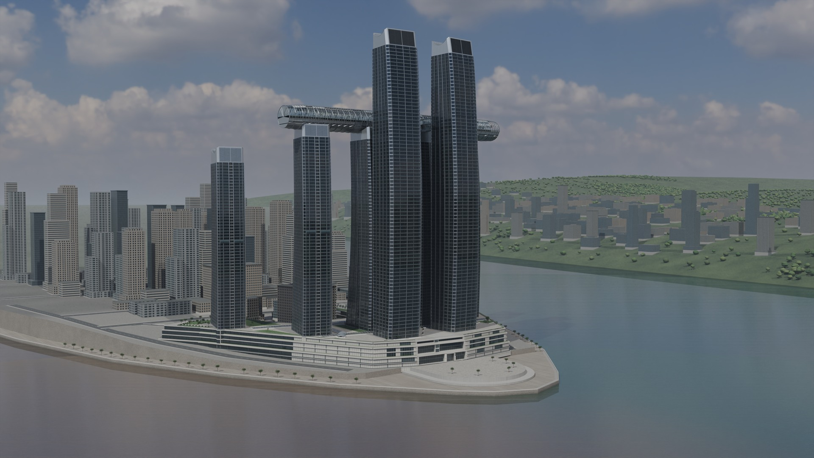
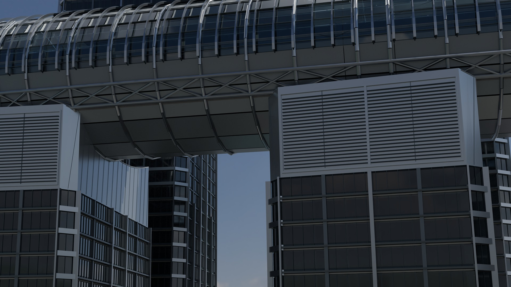
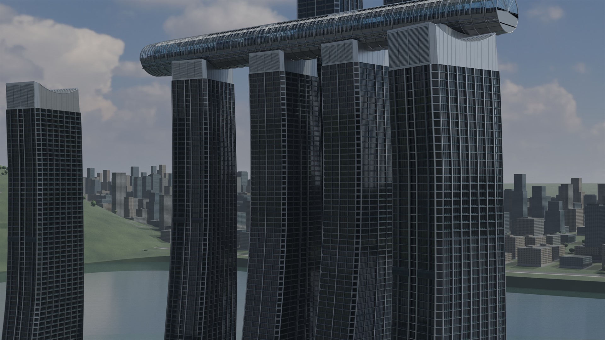
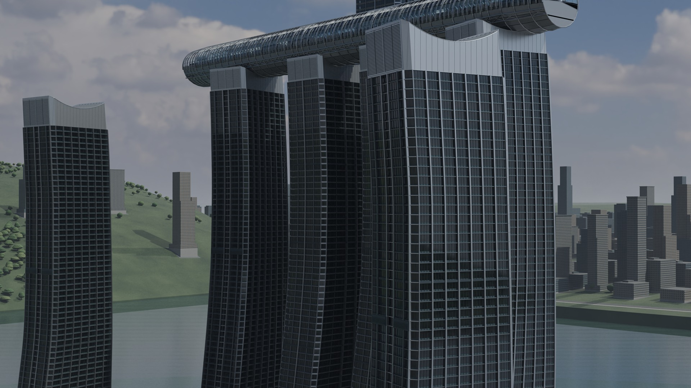
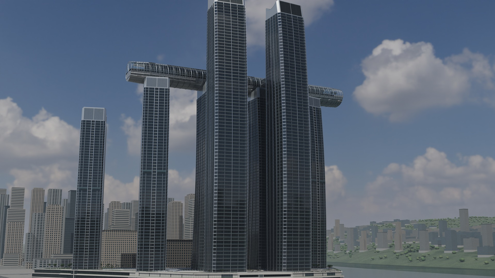
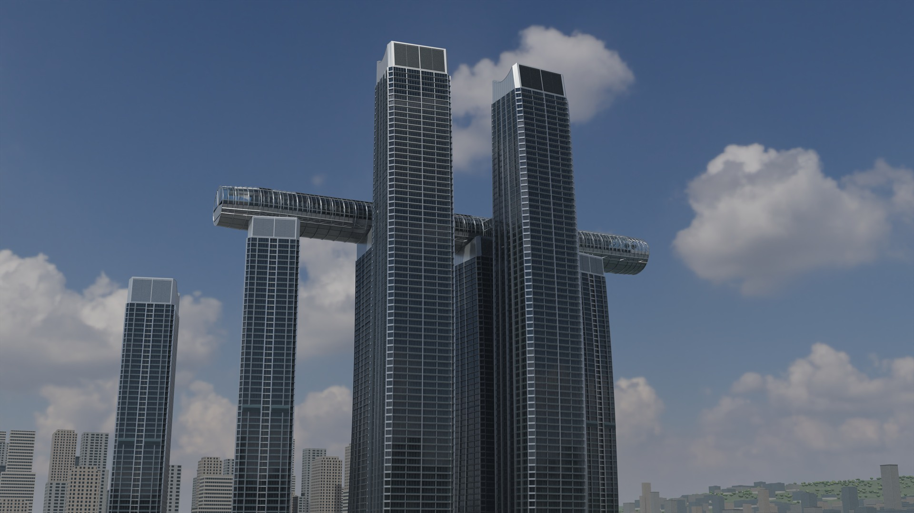
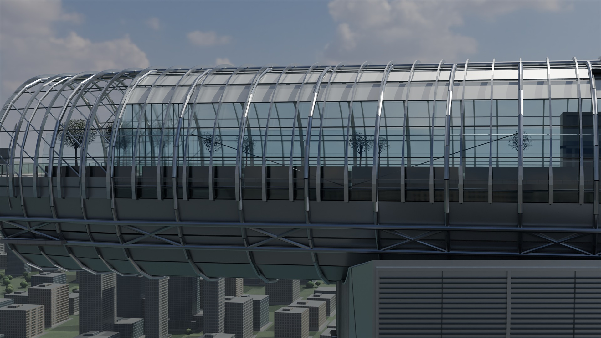
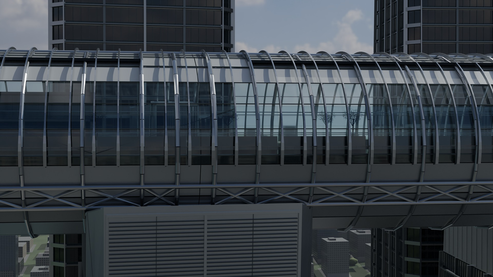
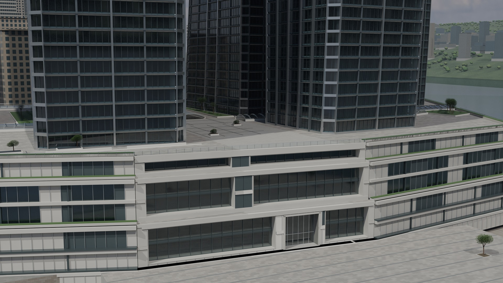
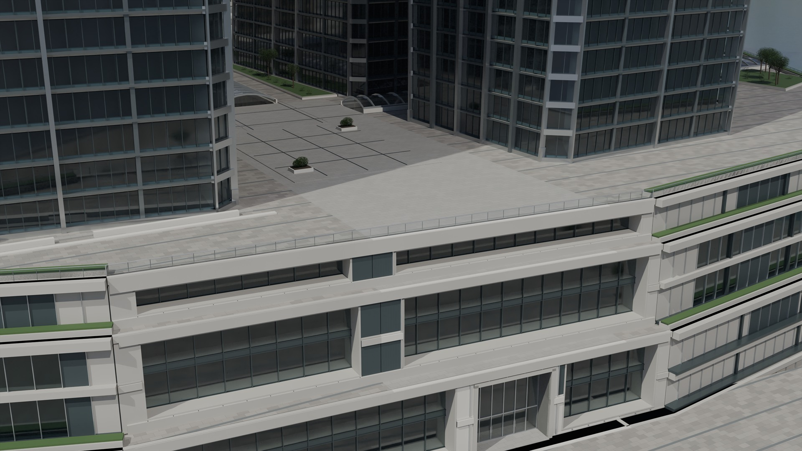

# Chongqing Raffles City
中文 · [English](README_EN.md)

Advertising-grade Blender visualization of Chongqing Raffles City with 4K renders and a standalone realtime free-roam viewer.

仓库地址：[GitHub Repository](https://github.com/xiaojunxiong666-pixel/Chongqing-Raffles-City)

> This is an unofficial visual reconstruction and portfolio-style delivery. It is not BIM, a survey, an as-built record, an official digital twin, or an official representation of Raffles City, Chongqing, CapitaLand, or any other rights holder.

## Overview

本项目是重庆来福士的 Blender 建筑可视化项目交付，版本标识为 v118。公开仓库保留说明文档、第三方声明、发布清单、校验清单和宣传图预览；体积较大的 Blend 分卷、素材包、合并工具包和 Viewer ZIP 只作为 GitHub Release v118 的下载资产发布。

几何、材质、灯光、相机和场景来自现有项目交付状态。本次发布只建立独立的 publication 目录，不回写原始 Blender 工程，不改写正式交付 ZIP。

## Highlights

- 现有 V2 建筑视觉重建，面向广告级静帧和实时展示。
- 10 张实际审计到的 3840×2160 PNG 宣传渲染图，并提供 1920×1080 JPEG 仓库预览。
- 05 号包提供无需 Blender、Python、Node 或互联网的本地实时自由漫游 Viewer。
- 01、02、04 三个包可在 Windows 上合并出最终 Blend；合并产物已做 Blender 5.2.1 LTS 无界面重开核验。
- 所有五个正式 ZIP 都小于 100,000,000 bytes，并有 SHA-256 校验值。

## Project Scope

本项目的事实边界：

- 重庆来福士相关建筑形体和城市环境是视觉重建输出。
- 公开资料、城市参考和项目管线数据用于识别城市关系；未把历史参考照片作为仓库图库或纹理发布。
- 未测量的建筑高度、距离、道路宽度、结构尺寸和其他工程细节属于视觉估计，不应当当作实测数据。
- 本项目不提供 BIM、测绘、施工图、竣工图、结构安全结论、官方授权或数字孪生保证。

## Download

请打开 [GitHub Releases / v118](https://github.com/xiaojunxiong666-pixel/Chongqing-Raffles-City/releases/tag/v118) 并下载五个正式资产：

| 文件 | 用途 | 是否必需 |
| --- | --- | --- |
| 01_最终Blend_分卷1.zip | 最终 Blend 分卷 1 | 与 02、04 一起使用 |
| 02_最终Blend_分卷2.zip | 最终 Blend 分卷 2 | 与 01、04 一起使用 |
| 03_Assets素材_中文.zip | 三个 Poly Haven CC0 HDRI 和素材说明 | 可选；最终 Blend 已打包必要图像 |
| 04_合并工具与验证说明_中文.zip | Windows 合并脚本、说明和验证记录 | 合并 01 + 02 必需 |
| 05_独立实时漫游Viewer_中文.zip | 独立本地实时 Viewer | 只想看 Viewer 时使用 |

Git 仓库本身不包含这五个 ZIP、Blend、GLB 或 HDR 文件。这样可以让仓库保持可浏览，同时让 Release 资产保留原始正式包及其 SHA-256。

## Full Blender Model

1. 下载 01、02、04 三个 ZIP。
2. 将三个 ZIP 解压到同一个父目录，并保留各自的顶层包目录。
3. 打开 04_合并工具与验证说明 目录。
4. 双击 ASCII 文件名的 <code>MERGE_BLEND.cmd</code>。同目录也保留中文入口 <code>合并并打开最终Blend.cmd</code>。
5. 脚本会递归找到 <code>.blend.part01</code> 和 <code>.blend.part02</code>，生成 <code>重庆来福士_v118_最终模型.blend</code>，并默认尝试用 Blender 打开。

合并脚本在本次干净解压测试中实际生成的 Blend SHA-256 为：

<code>f2e36b3a1e41138cfd841888353af8fdb269048c38f2c5df3a811f1c33213ccc</code>

现有测试还验证了该合并结果可以由 Blender 5.2.1 LTS 无界面重新打开，且没有外部 linked libraries。03 号素材包仍建议保存，用于查看被单独交付的 HDRI 源文件和许可信息。

## Realtime Free-Roam Viewer

下载并完整解压 05_独立实时漫游Viewer_中文.zip，然后双击根目录中的 <code>打开实时漫游Viewer.cmd</code>。它会启动本地 loopback 服务并打开默认浏览器；端口被占用时会自动尝试后续端口。

Viewer 是离线本地包：本次包内服务监听 127.0.0.1，不需要 Blender、Python、Node 或联网。请不要只复制单个 HTML；需要保留同一 ZIP 中的 <code>viewer</code>、<code>exports</code>、<code>server</code> 和 <code>vendor</code> 目录。

若只关闭浏览器标签页，本地 PowerShell 服务可能仍在后台运行。本包没有单独的 Stop 按钮；停止它时，在任务管理器中结束命令行包含 <code>server\portable_server.ps1</code> 且工作目录位于 Viewer 解压目录的对应 <code>powershell.exe</code>。

更完整的控制说明见 [docs/VIEWER_GUIDE.md](docs/VIEWER_GUIDE.md)。

## Controls

| 状态 | 操作 |
| --- | --- |
| 默认观察 | 鼠标拖拽旋转视角；滚轮缩放；点击 HERO、RIVER、CITY、CRYSTAL、PODIUM、LOW、HIGH、PODIUM_CLOSE 预设 |
| 进入自由漫游 | 点击“进入自由漫游”；浏览器允许时使用 pointer lock，否则按住鼠标左键观察 |
| 移动 | W 前进，S 后退，A 左移，D 右移 |
| 升降 | Q 降低，E 升高 |
| 加速 | Shift |
| 速度 | 下拉选择 6、18、45 或 100 m/s |
| 回到 Hero | Home |
| 重置 | “重置视角”按钮恢复当前预设 |
| 退出自由视角 | Esc 退出 pointer lock；再次点击按钮可重新进入 |
| 全屏 | “全屏”按钮；也可使用浏览器自己的全屏能力 |

## Tools & Workflow

- Blender 5.2.1 LTS；项目阶段记录中的 Cycles / EEVEE 结果均属于现有项目交付证据。
- Viewer 使用本地 three.js r186 运行时、GLTFLoader、HDRLoader 和 DRACOLoader。
- 01、02 是按 GitHub 单资产大小限制拆分的 Blend；04 只负责合并和验证，不重新建模。
- 本仓库中的 JPEG 是由现有 4K PNG 缩放生成的展示预览；原始 PNG 保留在项目源目录，未被本次发布流程改写。

## System Requirements

Full Blend：

- Windows，PowerShell，Blender 5.2.1 LTS 或兼容的更高版本。
- 打开和 Cycles 渲染完整场景需要较大的内存和显存；实际耗时取决于硬件、采样、输出分辨率和 Blender 设置。本项目不把单一测试机规格宣称为最低要求。

Realtime Viewer：

- Windows 10/11 64-bit 和支持 WebGL2 的现代 Chrome 或 Edge。
- 建议 16 GB 以上系统内存和独立 GPU；高分辨率显示或高画质浏览时，32 GB 内存和更强 GPU 会更舒适。
- 下载并解压后不需要互联网；浏览器必须允许访问本机 127.0.0.1。

上述 Viewer 建议是使用建议，不是经过所有硬件组合测得的硬性最低门槛。

## Data & Credits

请先阅读 [THIRD_PARTY_NOTICES.md](THIRD_PARTY_NOTICES.md)。

- OpenStreetMap 数据按 ODbL 归属 OpenStreetMap contributors；本公开包审计未发现原始 OSM 快照文件。
- Copernicus WorldDEM-30 / GLO-30 的项目来源说明和改编声明按官方要求保留。
- 03 号包中的三个 HDRI 来自 Poly Haven，均按 CC0 记录。
- Viewer 中的 three.js 和 Draco 运行时保留各自的第三方许可说明。
- 历史参考照片只作为建模参考，不在本仓库或五个正式下载包中再分发。

## Disclaimer

本项目是非官方的建筑可视化和实时展示。它不代表官方建筑资料，不保证 BIM 或测绘精度，也不提供工程、安全、规划、产权、品牌授权或数字孪生结论。涉及建筑、道路、城市关系和比例的内容，凡未有明确测量来源，均应视为视觉估计。

项目名称和现实建筑、企业、商标、地图与数据源的权利仍归相应权利人所有。本项目不暗示任何合作、背书或许可。

## License/Usage

本仓库没有创建新的 LICENSE 文件，也没有在没有明确授权的情况下推断项目内容可以按 MIT、CC-BY 或商业许可使用。原始项目内容归项目作者所有；第三方数据、软件和素材继续受其原始许可约束。若要再发布、商业使用、修改或将输出用于工程用途，请先取得相应权利人的明确许可并自行完成法律审查。

## Gallery

以下是本次实际检查到的 10 张仓库预览图。它们是从现有 3840×2160 PNG 生成的 1920×1080 JPEG，仅用于 GitHub 浏览。

| | |
| --- | --- |
|  |  |
|  |  |
|  |  |
|  |  |
|  |  |
